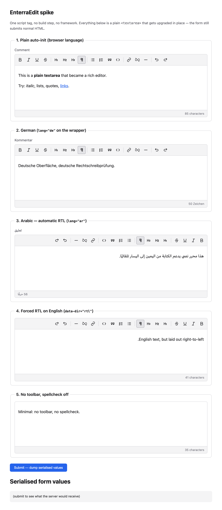
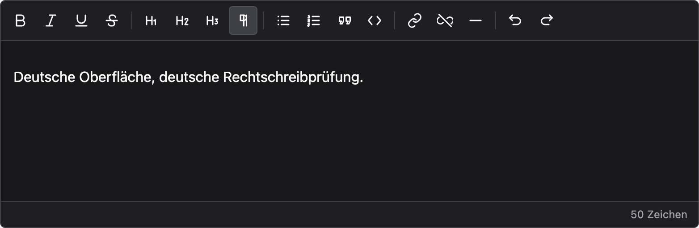
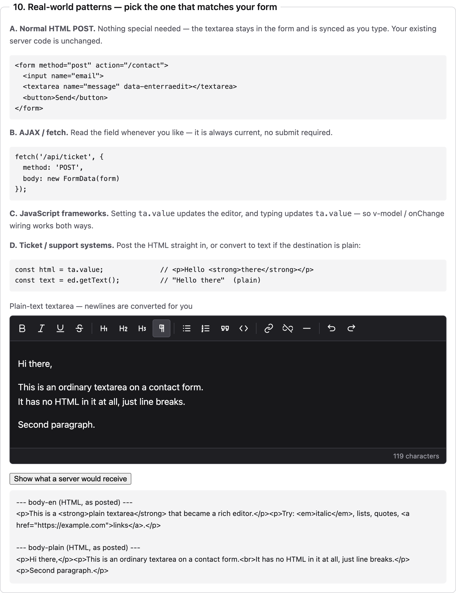
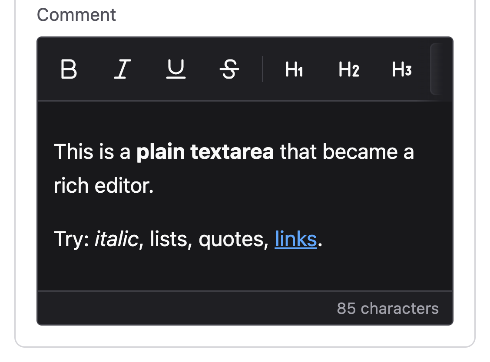
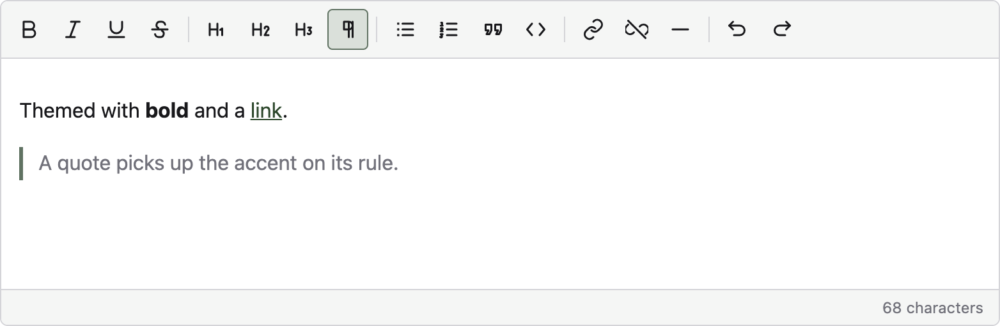
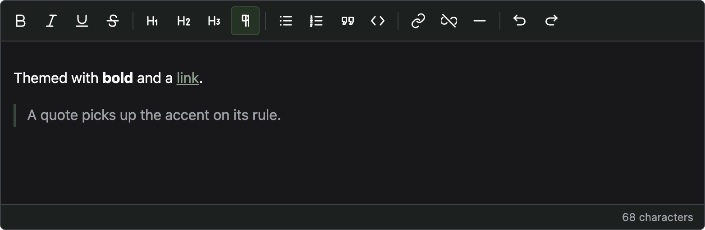

# EnterraEdit

A drop-in rich text editor. **One script tag, no build step, MIT.**

```html
<script src="enterraedit.min.js" data-enterraedit></script>

<textarea name="body" data-enterraedit>
 <p>Anything you like.</p>
</textarea>
```

That is the entire integration. No npm, no bundler, no framework, no GPL, no
licence key. The `<textarea>` stays in the DOM and stays in sync, so your
existing form and server code are unchanged.

One file, zero network requests, **100/100** browser tests passing. Around 76 KB
gzipped at v0.2.0 (quoted with the version, because it will move).

> **No branding in this build.** This is the self-hosted core. It adds nothing
> to your page: no badge, no backlink, no head comment. If you would rather not
> host it yourself, the [hosted build](https://enterrahost.com/enterraedit) is
> free and carries a small badge in exchange.

Built by [Enterrahost](https://enterrahost.com) on
[ProseMirror](https://prosemirror.net), so selection, paste, IME, undo, bidi and
accessibility are correct by construction rather than hand-rolled.



## Getting the file

**Not on npm yet.** Until it is, build it yourself:

```sh
git clone https://github.com/enterrahost/enterraedit.git
cd enterraedit
npm install && npm run build # → dist/enterraedit.min.js
```

Copy `dist/enterraedit.min.js` into your project and point the script tag at
it. It is a single self-contained file: ProseMirror is compiled in, so there
are no runtime dependencies and no network requests.

A hosted CDN build is also planned, which is what the badge-free note at the
top refers to.

## What this is

A real ProseMirror document model, wrapped in the declarative drop-in layer
worth keeping from the original.

```html
<script src="enterraedit.min.js" data-enterraedit></script>

<textarea name="body" data-enterraedit>
 <p>Anything you like.</p>
</textarea>
```

That is the entire integration. No npm, no bundler, no React, no framework, no
GPL, no licence key. The `<textarea>` stays in the DOM and stays in sync, so the
form submits normal HTML and the editor is pure progressive enhancement.

---

## What it does

### What the engine gives you

Everything the original hand-rolled is now ProseMirror's, and correct by
construction:

| Concern | Original | Spike |
| --- | --- | --- |
| Editing model | `contenteditable` + `execCommand` (deprecated) | Real document model + transactions |
| Undo/redo | Full-`innerHTML` snapshots, could go permanently dead | `prosemirror-history`, correct |
| Keyboard shortcuts | **none** | `Mod-b/i/u/k/z/y`, `Shift-Mod-z` |
| Paste | **none** (Word paste was catastrophic) | Inherited, schema-validated |
| IME / composition | **none** | Inherited |
| Selection across edits | hand-managed | Inherited |
| Media insert | **threw every time** | Not in spike (see gaps) |

### i18n drives tooltips, accessible names, *and* spellcheck

One string table feeds three consumers, so a translation is written once:



```js
strings.de = { bold: 'Fett', italic: 'Kursiv', /* other keys omitted */ };
// ↓ ↓
// title="Fett" aria-label="Fett"
```

Resolution order, all verified in the browser:

1. nearest ancestor `lang` / `data-lang`, so `<fieldset lang="de">` works
2. explicit `lang` option
3. `data-lang` / `?lang=` on the script tag
4. `document.documentElement.lang`
5. `navigator.language`
6. English

Note the loader is matched by a **`data-enterraedit` marker, not the filename**.
The original matched on the substring `'enterra-edit'`, so *renaming the file
silently broke licensing*, which is unacceptable for a file people self-host.

### Spellcheck: browser-native, as requested

No dictionary engine, no third-party service, no user text leaving the browser:

```html
<div contenteditable spellcheck="true" lang="de" autocorrect="on">
```

`lang` is passed through faithfully, which is what makes the browser pick the
right dictionary. Right-click suggestions are the browser's own. Per-instance
opt-out via `data-spellcheck="false"`.

### RTL

`lang="ar"` auto-detects RTL; `data-dir="rtl"` forces it. Two details that are
easy to get wrong and are handled here:

- **Logical CSS properties** (`margin-inline-start`, not `margin-left`), so one
 stylesheet is correct in both directions, and the toolbar mirrors with no
 direction-specific rules.
- **Bidi isolation on the status bar.** Without it the Arabic count renders as
 `حرفًا 56` instead of `56 حرفًا`. Caught by screenshot, then locked down by
 test.

### Accessibility

| | Original | Spike |
| --- | --- | --- |
| `aria-label` on buttons | **0 of 32** | 16 of 16 |
| `role="toolbar"` | no | yes, with `aria-label` |
| `role="textbox"` + `aria-multiline` | no | yes |
| `aria-pressed` on toggles | no | 10 toggles |
| Arrow-key toolbar nav | no | WAI-ARIA roving tabindex |
| Visible focus ring | no | `:focus-visible` |
| Decorative icons hidden | no | `aria-hidden` |
| `destroy()` for teardown | **none** (leaked timers) | yes |
| `prefers-reduced-motion` | no | honoured |
| Dark mode | no | `prefers-color-scheme` |

The toolbar is a single tab stop with arrow-key navigation, so a keyboard user
doesn't need 16 tab presses to get past it.

### Security

URLs are validated in the **schema's link mark**, not at the call sites. That
distinction matters: there are three ways an href can enter the document (the
link dialog, `setHTML()`, and paste or initial textarea content), and only the
first is under the UI's control.

A `javascript:` href accepted by any route would sit in `getHTML()`, be posted to
the server, and execute for whoever later renders that page. So the check runs
where the mark is parsed and where it is serialised, covering every path at once.

- Scheme allowlist: `http`, `https`, `mailto`, `tel`, plus relative and fragment
 URLs. `javascript:`, `data:`, `vbscript:` and `blob:` are rejected.
- Control characters and newlines are rejected first, since those are how
 `java\nscript:` is smuggled past a filter that only reads the start.
- Rejected links lose the mark but **keep their text**, so content is never lost.
- Accepted links are serialised with `rel="noopener noreferrer nofollow"`.

Asserted in the suite against a live browser: a `javascript:` link pasted into
`setHTML()` comes out as plain text, and a page rendering the stored output
cannot execute it.

### Content Security Policy

The editor injects its own stylesheet as a `<style>` element. Under a strict
`style-src` that element is refused, so **the editor renders and works but
loses every style**: no border, no toolbar background, no button states. It
looks like a CSS bug rather than a policy block.

Two fixes, both measured against a live CSP.

**Option 1, add the hash.** Tighter, and it is the only relaxation needed. The
stylesheet is a fixed string so it has one hash:

```
Content-Security-Policy:
  default-src 'self';
  script-src 'self';
  style-src 'self' 'sha256-08UupLnzS7E6Os/0+KpoveHG3YRCsvqg58Sz+DGRDLE=';
```

**This hash changes whenever the editor's styles change**, so it must be
updated when you upgrade. A mismatch silently returns you to an unstyled
editor, so it is worth a smoke test after any version bump.

**Option 2, allow inline styles.** Simpler, less tight, but immune to upgrades:

```
style-src 'self' 'unsafe-inline';
```

Measured behaviour of both, plus the failure mode:

| `style-src` | Result |
| --- | --- |
| `'self'` | renders, **completely unstyled** |
| `'self' 'sha256-...'` | fully styled, including themed tokens |
| `'self' 'unsafe-inline'` | fully styled |

The editor needs no `script-src` relaxation. It does not use `eval`,
`new Function` or string timers, and it injects no scripts. It makes no network
requests, loads no fonts or images of its own and uses no `connect-src`, so
`default-src 'self'` is otherwise sufficient.

### Getting the text out

This is the part that decides whether the thing is usable, so it is worth being
precise: **the `<textarea>` never stops being the form field.** The editor is
progressive enhancement over it, not a replacement. Whatever your existing code
does with that field, it keeps working.

The value is written back on **every keystroke**, not on submit. That matters,
because most real integrations never submit the form at all.

**A. Normal HTML POST**: nothing to do:

```html
<form method="post" action="/contact">
 <input name="email">
 <textarea name="message" data-enterraedit></textarea>
 <button>Send</button>
</form>
```

`$_POST['message']` receives `<p>Hello <strong>there</strong></p>`.

**B. AJAX / fetch**: read the field whenever you like:

```js
fetch('/api/ticket', { method: 'POST', body: new FormData(form) });
```

**C. JavaScript frameworks**: sync runs both ways. Typing updates `ta.value`;
assigning `ta.value` updates the editor (the prototype setter is patched once,
dispatching a normal `input` event, which is what frameworks listen for anyway).

**D. Ticket / support systems**: post the HTML, or convert:

```js
const html = ta.value; // <p>Hello <strong>there</strong></p>
const text = ed.getText(); // "Hello there" (plain, for plain destinations)
```



**Plain-text fields just work.** A contact-form textarea usually contains text,
not markup. If the source has no block-level HTML, newlines are converted to
paragraphs and `<angle brackets>` are escaped rather than parsed:

```
Hi there, <p>Hi there,</p>
 <p>This is a &lt;tag&gt; ...</p>
This is a <tag> and a new line
```

Two edge cases are handled that are easy to miss:

- **`form.reset()`** restores the field's *default* value rather than emptying
 it, and the editor follows instead of showing stale content.
- **External writes** (React, jQuery, a script) flow into the editor, so the two
 never drift apart.

The source element also keeps its `name`, stays a real `<textarea>`, and
`required` validation still applies to it.

### Sizing

```html
<textarea data-enterraedit></textarea> <!-- fills container -->
<textarea data-enterraedit data-width="420px"></textarea> <!-- fixed -->
<textarea data-enterraedit data-height="auto"></textarea> <!-- grows with content -->
<textarea data-enterraedit data-rows="6"></textarea> <!-- line-count based -->
```

```js
new EnterraEdit({ element: el, width: '100%', minHeight: 200, maxHeight: '40vh' });
editor.setSize({ width: '640px' }); // runtime
```

Width uses `inline-size`, so it mirrors correctly in RTL. Sizes are applied as
custom properties rather than inline `width`/`height`, because an inline
dimension beats every stylesheet rule and would make the editor unfixable on
small screens.

### Responsive

No framework, no viewport hacks:

| Breakpoint | Behaviour |
| --- | --- |
| any | fills its container, capped so text never stretches to an unreadable measure |
| ≤ 600px | tighter padding, shorter minimum height |
| ≤ 420px | toolbar scrolls sideways rather than wrapping into four rows; badge hidden |
| `pointer: coarse` | touch targets grow to 40px |
| landscape phone | height cap reduced, since viewport height is the scarce resource |



### Fonts

**No webfonts are bundled or downloaded.** The default is `inherit`, so the
editor uses whatever font the surrounding page already uses. That avoids a download, a
licensing obligation, and a font that is probably wrong for the site it lands in.

```html
<textarea data-enterraedit data-font="serif"></textarea>
<textarea data-enterraedit data-font="Georgia, serif"></textarea> <!-- any CSS stack -->
```

Presets (`sans`, `serif`, `mono`, `rounded`, `arabic`, `hebrew`) are all system
fonts. **RTL languages get a script-appropriate stack automatically**: Arabic
rendered in a Latin-first stack shapes diacritics badly, so `lang="ar"` switches
to a Naskh-first stack unless the caller asked for something specific.

If you want a self-hosted webfont, point the option at it. Your font, your
licence:

```js
new EnterraEdit({ element: el, font: "'My Font', sans-serif" });
```

### Self-contained

The original loaded Font Awesome from a CDN for all 32 icons, so offline **every
icon disappeared** with no text fallback. Icons are now inline SVG, and styles
are injected by JS. The browser test asserts **zero external network requests**.

### Theming

Every colour already flowed through CSS custom properties, so a theme is just a
bag of values for those properties. Four presets ship (`light`, `dark`, `sepia`,
`contrast`), plus `auto` to follow the OS. `auto` tracks live changes rather
than reading the setting once.

```js
new EnterraEdit({ element: el, theme: 'dark' });
new EnterraEdit({ element: el, theme: 'light', accent: '#345332' });
new EnterraEdit({ element: el, theme: { '--ee-bg': '#101418' } }); // full custom
editor.setTheme('sepia'); // runtime
```

Declarative too, for the drop-in path:

```html
<textarea data-enterraedit data-theme="dark" data-accent="#345332"></textarea>
```

**The accent is the interesting part.** One hex has to work as link text, as an
active-button tint, *and* as a toolbar wash, in whichever mode is active. Using
the raw value for both modes gives unreadable results: `#345332` as link text on
a dark surface is nearly invisible. So `accentTokens()` derives the whole family
per mode, checking against the background and nudging until it clears WCAG AA
(4.5:1).

Measured, and asserted in the test suite:

| Accent `#345332` | Derived | Contrast |
| --- | --- | --- |
| light mode | `#2c472b` | **10.28:1** |
| dark mode | `#8fa08e` | **6.40:1** |



The same hex in dark mode, where the link lightens rather than staying raw:



Because these are plain CSS variables set inline on `.ee-root`, a host page can
restyle anything with ordinary CSS and no JS at all:

```css
.ee-root { --ee-focus: rebeccapurple; --ee-radius: 0; }
```

---

## Layout

```
enterraedit-core/
├── src/
│ ├── editor.js drop-in layer, toolbar, form sync, public API
│ ├── i18n.js string table + language resolution
│ ├── icons.js inline SVG (replaces Font Awesome)
│ ├── schema.js document model, validates link hrefs
│ ├── url.js URL scheme allowlist
│ ├── styles.js logical-property CSS, reduced-motion
│ ├── themes.js 4 presets + accent derivation with contrast checking
│ ├── branding.js attribution provider API (empty by default)
│ ├── sizing.js width/height options, font stacks, responsiveness
│ ├── version.js GENERATED from package.json on prebuild
│ └── index.js
├── scripts/
│ ├── sync-version.mjs keeps version.js in step with package.json
│ └── check-readme-images.mjs fails the build on a broken README image
├── demo/index.html 10 sections: languages, RTL, themes, sizing, forms
├── dist/ built bundle, gitignored and built on publish
├── test.mjs 100 real-browser assertions
└── shots/ screenshots used by this README
```

## Build & test

For working on the editor itself. Clone this repo first; **the package is not
published to npm yet**, so `npm install enterraedit` will not work.

```sh
npm install
npm run build # → dist/enterraedit.min.js, ~76 KB gzipped
npm test # image check + 100/100 assertions in a real browser
```

`npm test` first verifies that every image referenced in this README actually
exists. A missing screenshot renders as a broken-icon box on the repository
page, which is invisible when editing locally and is the first thing a visitor
sees, so it gets a check rather than care.

`test.mjs` drives a real Chrome via `puppeteer-core` and asserts *behaviour*:
typing, `Mod-b`, undo, `aria-pressed` flipping, RTL direction, form sync, theme
switching, WCAG contrast of derived accents, form submission, and the XSS
guard. Behavioural claims are observed, not inferred.

---

## Known limitations

Things that are missing or rough, roughly in the order they would bite you.

**The link dialog is `window.prompt`.** It works, but it cannot be styled, has no
focus trap, and is the weakest remaining piece of the accessibility story. Media
and image insertion are not implemented at all. The editor handles text,
structure and links, and stops there.

**Paste is whatever ProseMirror gives us.** Content is validated against the
schema, so nothing invalid gets in, but there is no explicit "paste as plain
text" or Word-cleanup pass.

**The accessibility work is asserted, not experienced.** Every button has an
accessible name, the toolbar follows the ARIA pattern, and the tests check all of
it, but no one has driven this with VoiceOver or NVDA yet. Structural
correctness and usability are not the same claim.

**No CI, and nothing on npm yet.** Tests have to be run by hand.

**The `--ee-*` theme tokens are undocumented.** They are plain CSS custom
properties and easy to override, but there is no table saying what each one
controls, so writing a custom theme currently means reading `styles.js`.

**Around 76 KB gzipped** at v0.2.0. Reasonable for a full document model, not
small. If size is the deciding factor, Lexical is lighter.
